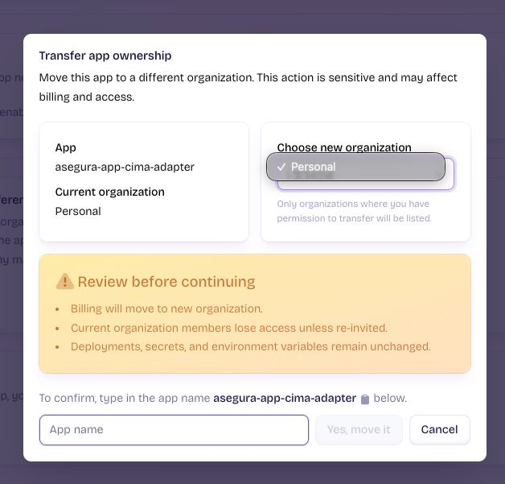

# Defensa de cartera — el agente que pelea la renovación (idea de Alberto, 01/09/2026)



> Idea de producto de Alberto, guardada tal cual la dibujó. **No está implementada**: esto es
> el destino, no el estado. Lo que sí existe hoy está marcado ✅ abajo.

## El flujo

```
Recibo de precartera
        ↓
🤖 Agente IA «Defensa cartera»  (analiza recibos · servicio NOCTURNO)
        ↓ cumple reglas
   Tarificar riesgo
        ↓
   Analizar primas: NUEVA PRODUCCIÓN vs CARTERA
        ├──→ Pantalla «desviación de recibos»
        └──→ (configuración de avisos) → Generar respuesta al cliente
```

## Por qué esto es lo correcto para una correduría

La renovación no se pelea con el vencimiento: se pelea con **el recibo de precartera**, que es
cuando la compañía te enseña la prima del año que viene ANTES de girarla. Ahí es cuando todavía
se puede hacer algo. El agente convierte ese aviso en tres cosas: saber cuánto sube, saber si el
mercado da algo mejor, y tener la respuesta al cliente escrita antes de que llame él.

La comparación **nueva producción vs cartera** es la palanca medida del sector (Asegurómetro
2T 2026: auto en cartera 470€ **+4,7%** frente a nueva producción 441€ **−2,2%**). El precio de
captación existe: si tu compañía sube y otra capta más barato, la póliza se mueve en vez de
perderse. Eso es exactamente lo que hace este flujo.

## Qué hay ya construido ✅

- **Vencimientos con la ventana legal** (`@central/module-seguros/vencimientos`): urgencia por el
  preaviso de UN MES del tomador y fecha límite de oposición (LCS art. 22).
- **Preaviso de DOS MESES del asegurador** (`comunicacionEnPlazo`): si la compañía no comunicó la
  subida a tiempo, no puede imponerla. Es el argumento más fuerte del flujo y ya está codificado.
- **Puerto de lectura de la cartera** y **aviso automático** por Telegram (cron diario 06:30).
- **Prima que la compañía no informa = `null`**, nunca 0 €.

## Qué falta, por orden de dependencia

1. **La fuente «recibo de precartera».** Hoy `poliza_recibos` tiene `situacion` (cobrado ·
   pendiente · devuelto · anulado) y `clase_recibo` (CA · SU · NP). Hay que confirmar **cuál de
   esos estados es la precartera** contra un fichero EIAC real antes de construir nada encima:
   equivocarse aquí es avisar de recibos que ya están cobrados.
2. **Tarificar riesgo** → depende de la API de Avant2 (Codeoscopic), hoy bloqueada por el host
   base y las credenciales de sandbox. 🚨 **Cada cotización cuesta 0,50 €** (tarifa de Ángel
   Blesa, 09/04/2026): un agente nocturno que retarifique la cartera entera tiene coste real y
   necesita presupuesto y tope, como la pasarela de IA. No se tarifica en bucle «por si acaso».
3. **Pantalla de desviación de recibos**: prima nueva vs prima anterior vs mediana de mercado.
   El helper del titular va PURO y testeado, como el resto.
4. **Generar respuesta al cliente** → es **Fase 3** y no se activa sin diseño de canal + OK
   explícito de Alberto. 🚨 Además la **Ley 10/2025 de atención a la clientela** (adaptación hasta
   el 28/12/2026) prohíbe que el servicio se base solo en bots: el escape a persona se diseña
   desde el principio, no se añade después. El andamiaje de bot que dejó Manuel en la BD
   (`whatsapp_kb_chunks`, `channel_inbound_messages`, `bot_turn_traces`…, todo a 0 filas) es el
   sitio donde mirar antes de inventar un esquema nuevo.

## Reglas que no se negocian en este flujo

- **Nada sale al cliente sin que Alberto lo apruebe.** El agente redacta; envía él.
- Una subida detectada **no se afirma como inoponible** sin la fecha de comunicación de la
  compañía: `comunicacionEnPlazo` devuelve `null` cuando no consta, y ese `null` se pinta.
- «No he podido tarificar» y «no hay nada mejor en el mercado» son cosas distintas y la pantalla
  tiene que poder decir las dos.
