# Mapa de agentes del monorepo `central`

> Fuente de verdad narrativa del ecosistema de agentes. El catálogo en código que alimenta el panel
> `/operador/agentes` vive en `apps/plataforma/lib/agentes-catalogo.ts` (espeja este doc). La frescura
> factual la reconcilia `/auditoria-diaria`; las cadencias detalladas de las rutinas Claude están en
> `docs/RUTINAS-PROGRAMADAS.md` y los crons en el `vercel.json` de cada app.

> El panel `/operador/agentes` muestra estos autónomos **junto a** los **asistentes IA** (funciones que
> responden a una persona: copilotos, voz, visión, OCR, chats por pantalla) que cataloga
> `apps/plataforma/lib/estructura.ts` — con un filtro Autónomos / Asistentes. Este doc cubre solo los autónomos.

Hay **tres familias** de agentes:

- **A · Rutinas Claude Code web** — sesiones Claude disparadas por un trigger (creado a mano en
  `claude.ai/code → Rutinas`). Cada una es una skill en `.claude/skills/<nombre>/`.
- **B · Agente Director** — router de modelos LLM de la pasarela de IA (`/api/ai/*`) sobre OpenRouter,
  más su meta-agente cron que mantiene el catálogo. **No** orquesta a los agentes de negocio: elige
  qué modelo atiende cada petición.
- **C · Crons agénticos de Vercel** — código (rutas API) disparado por `crons[]` de cada `vercel.json`.

```mermaid
flowchart TB
  subgraph A["A · Rutinas Claude Code (por trigger)"]
    A1["Auditoría diaria/semanal"]
    A2["facturas-correo"]
    A3["pricing-agente (SIVRA)"]
    A4["fiscal-novedades"]
    A5["psd2-health-check"]
    A6["ialimp-client-health"]
    A7["rrhh-compliance"]
    A8["github-vigia"]
    A9["agentes-entrenador"]
    A10["buscador-ia"]
    A11["conectores-vigia"]
  end

  subgraph B["B · Agente Director (pasarela IA)"]
    D["Director: elige modelo por petición\n(presupuesto · contexto · RGPD)"]
    CAT["ia_director_prompt\n(catálogo versionado)"]
    RF["cron ia-director-refresh\n(regenera catálogo + aprendizaje)"]
    APR["ia_director_aprendizaje\n(rendimiento real)"]
    DC["Director de CÓDIGO: acota archivos\n(0 tokens, word_similarity)"]
    MA["mapa_arquitectura\n(índice de firmas del repo)"]
    RF -->|versiona| CAT
    RF -->|snapshot| APR
    APR -->|penaliza malos| RF
    CAT -->|allowlist| D
    MA -->|acota| DC
    CAT -->|elige modelo| DC
  end

  subgraph C["C · Crons agénticos de Vercel"]
    C1["correo-triaje"]
    C2["agente-huésped (SIVRA)"]
    C3["contable-proactivo"]
    C4["concursos"]
    C5["facturas-proveedor"]
    C6["gastos-sivra"]
    C7["ia-rest: SEO · Instagram · CRM"]
    C8["ialimp: mailing · impagos"]
  end

  GW["Pasarela /api/ai/* (chatConDirector)"]
  C3 -->|enruta por| GW
  A9 -.mejora prompts.-> A
  A9 -.mejora prompts.-> C2
  A8 -.vigila deps.-> C
  A10 -.vigila LLMs.-> B
  GW --> D
  A -->|avisos| TG["Telegram (/api/internal/alerta)"]
  C -->|avisos| TG
  RF --> TG
```

## A · Rutinas Claude Code (por trigger)

| Agente | Función | Cadencia | Entrega | Telegram | Archivo |
|---|---|---|---|---|---|
| Auditoría nocturna ligera | Reconcilia memoria+skills+docs vs código/infra; vigila crons | Diaria 04:00 | texto→main / raro→PR draft | ✅ | `.claude/skills/auditoria-central` · `/auditoria-diaria` |
| Auditoría semanal profunda | Typecheck 4 apps + tests + seguridad multi-tenant + infra | Domingo 04:00 | mixto + informe | ✅ | `auditoria-central --profunda` |
| Facturas correo | Gmail → clasifica facturas → Drive → concilia con banca | Diaria 08:00 | PR draft | ✅ | `.claude/skills/facturas-correo` |
| Pricing agente (SIVRA) | Estudia mercado → precio → aplica por Paso 4 → aprende en BD | Lunes 06:00 | PR draft | ✅ | `.claude/skills/pricing-agente` |
| Vigilante fiscal IRPF + ayudas | Contrasta importes con BOE/BOJA; actualiza constante + BD. Además radar de convocatorias de ayudas → Telegram | Día 1 mes 07:00 | PR draft | ✅ | `.claude/skills/fiscal-novedades` |
| Guardián PSD2 | Verifica que la banca llega fresca (<48h); alerta si roto | Miércoles 09:00 | solo lectura | ✅ | `.claude/skills/psd2-health-check` |
| ialimp client health | Pulso semanal de Sique Brilla (PMS, impagos…) | Viernes 17:00 | solo lectura | ✅ | `.claude/skills/ialimp-client-health` |
| RRHH compliance calendar | Filtra obligaciones legales 🔴 pendientes e informa plazos | Día 1 mes 08:00 | solo lectura | — | `.claude/skills/rrhh-compliance-calendar` |
| Vigía GitHub/OSS | Releases vigilados + descubrimiento + npm outdated/CVE | Día 15 mes 07:00 · *pendiente trigger* | PR draft | ✅ | `.claude/skills/github-vigia` |
| Agentes-entrenador | Mejora los prompts de los agentes por rendimiento/calidad | Domingo 07:30 | PR draft | ✅ | `.claude/skills/agentes-entrenador` |
| Buscador de IA | Watch de deprecación + descubrimiento + mini-eval de core-ai | Lunes 07:00 · *pendiente trigger* | PR draft | ✅ | `.claude/skills/buscador-ia` |
| Vigía de conectores MCP | Huecos vs registro + canario sobre los conectores en uso + higiene de los conectados | Día 5 mes 04:00 · *pendiente trigger* | PR draft | ✅ | `.claude/skills/conectores-vigia` |

## B · Agente Director (pasarela IA)

| Pieza | Función | Cadencia | Archivo |
|---|---|---|---|
| **Agente Director** (router) | Un LLM barato elige el slug ideal del catálogo por petición. El catálogo se **estrecha antes de decidir** según presupuesto del día (degradación gradual a modelos baratos), tamaño real de la petición (contexto) y RGPD (`eu`). Modo **sombra** por defecto; `activo` enruta de verdad. | En cada petición `/api/ai/*` | `lib/ia-director.ts` + `lib/director-modelos.ts` (filtro puro) |
| **Meta-agente investigador** | Regenera el catálogo desde OpenRouter (`/api/v1/models`), versiona prompt+catálogo, vigila créditos, y aplica el **bucle de aprendizaje**: penaliza modelos con mala racha (error_rate/latencia) desde `ai_usos` y guarda snapshot en `ia_director_aprendizaje`. | Lunes 05:00 (cron Vercel) | `app/api/cron/ia-director-refresh/route.ts` |
| **Núcleo reutilizable** | `chatConDirector` — cualquier agente interno de plataforma enruta por el Director en vez de fijar su modelo (primer consumidor: el agente contable). | — | `lib/pasarela.ts` |
| **Director de CÓDIGO** (ahorro de tokens) | Dada una orden de desarrollo ("arregla el bug del login"), ACOTA a **coste 0 tokens** qué archivo(s) tocar: busca por `word_similarity`/pg_trgm en la tabla `mapa_arquitectura` (índice de firmas del repo, poblado por `auditar-estructura.mjs` → `docs/mapa-funciones.generated.json` → puerto `/api/internal/mapa-arquitectura` desde `auditoria.yml`), y elige el modelo reutilizando `elegirModelo`. Devuelve archivos candidatos + modelo; **NO edita** (el agente lee el archivo entero y devuelve diff). Categoría `codigo` en el catálogo. Degrada solo (`sinMapa`/`stale`). | Por petición `/api/ai/codigo` | `lib/ia-director-codigo.ts` + tabla `mapa_arquitectura` |

Envs de control: `DIRECTOR_MODO`, `DIRECTOR_PRESUPUESTO_UMBRAL`, `DIRECTOR_PRESUPUESTO_PRECIO_OUT`,
`DIRECTOR_MAX_PRECIO_OUT`, `DIRECTOR_APRENDIZAJE_DIAS`, `DIRECTOR_MAX_ERROR_RATE`, `DIRECTOR_MAX_MS`,
`DIRECTOR_MIN_LLAMADAS`, `MAPA_STALE_DIAS` (frescura del mapa de código, default 7). Observabilidad en `/operador/ia`.

## C · Crons agénticos de Vercel (destacados)

| Agente | Función | Cadencia | Vertical | Archivo |
|---|---|---|---|---|
| Triaje de correo | Lee Gmail por IMAP, clasifica y actúa (ruido/contabilidad/avisos) | cada 10 min | Plataforma | `lib/correo/` |
| Agente huésped (SIVRA) | Conversa con huéspedes; solo redacta borradores | cada 3 min + webhook | SIVRA | `lib/sivra/agente-huesped/` |
| Agente contable proactivo | Chat financiero + avisos de movimientos dudosos (enruta por Director) | Lunes 09:00 | Plataforma | `lib/contable/` |
| Agente de concursos | Ingesta PLACSP, radar por CPV, avisos y cierre | cada 6 h | Plataforma | `@central/module-concursos` |
| Radar de subastas | Ingiere BOE + comparables Idealista, enriquece (ficha, Catastro), calcula coste real, puja máxima y yield con datos propios, detecta chollos/bajadas, captura adjudicaciones, avisa con botones y vigila la antesala concursal (BORME) | diaria 06:00–09:00 | Plataforma | `@central/module-subastas` |
| Agente de pago de facturas | Escanea facturas proveedor → OCR → paga (PIS/SEPA) → concilia | diaria 06:15 | Plataforma | `lib/agente-facturas/pagos.ts` |
| Agente de gastos SIVRA | Escaneo de gastos de pisos + resumen | diaria 06:00 | SIVRA | `/api/sivra/expenses/agent/*` |
| SEO / Instagram / CRM (ia-rest) | Contenido SEO, redes y prospección comercial | varias | ia-rest | `apps/ia-rest /api/cron/*` |
| Mailing / impagos (ialimp) | Captación en frío y recordatorios de impago | cada 3 min / diaria | IALIMP | `apps/ialimp` |

_Última actualización: 2026-07-09._
