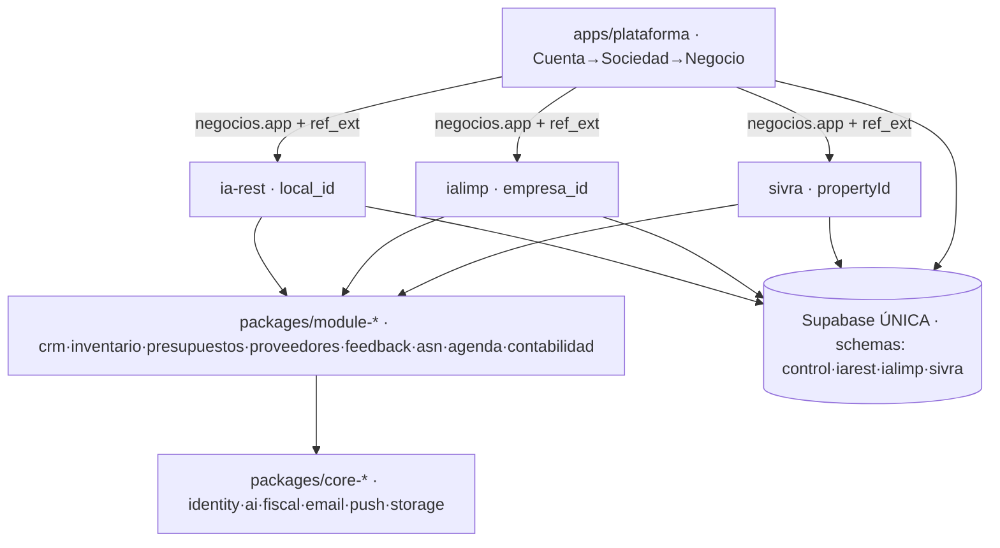

# Informe de unificación de `central` (casa de marcas)

> Fecha: 2026-06-09 · Estado: análisis + decisión de arquitectura de datos + plan de fases.
> Relacionado: `MATRIZ.md`, `docs/PLAN-plataforma-modular.md`,
> `docs/DISENO-modularizacion-verticales.md`, `docs/DISENO-modulos-materiales-flota.md`.

## Por qué este informe

Antes de añadir verticales nuevas (alquiler de materiales, flota), foto completa de lo que
tenemos en las 4 apps (`ia-rest`, `ialimp`, `sivra`, `plataforma`) y los `packages/*`, para
**terminar de unificar todo**: qué está ya compartido vs duplicado, un esquema de capas, la
decisión de arquitectura de datos, y el plan priorizado por fases.

---

## 1 — Estado de unificación

### 1.1 Las 4 apps (snapshot)

| App | Next.js | BD Supabase | Auth | Multi-tenant (id → `refExt`) | Estilos |
|---|---|---|---|---|---|
| **ia-rest** (hostelería) | **16.2.6** | **`efncqyvhniaxsirhdxaa` (SEPARADA)** | JWT propio (`lib/session.ts`) | `local_id` | Tailwind v4 |
| **ialimp** (limpieza) | 15.5.18 | `wswbehlcuxqxyinousql` (compartida) | jose+bcrypt (`ialimp_session`+`jti`) | `empresa_id` | Tailwind |
| **sivra** (pisos) | 15.3.1 | `wswbehlcuxqxyinousql` (compartida) | **NextAuth v5** | `propertyId` (mono-tenant) | Tailwind |
| **plataforma** (consolidador) | 15.5.18 | `wswbehlcuxqxyinousql` + lee ia-rest vía service-role | jose+bcrypt (`plataforma_session`+`cuentas.session_jti`) | — (dueña de `Cuenta→Sociedad→Negocio`) | CSS vars |

### 1.2 Adopción de `packages/*` (✅ usa · 🔁 duplicado local · ❌ n/a)

| Núcleo/Módulo | ia-rest | ialimp | sivra | plataforma | Veredicto |
|---|:--:|:--:|:--:|:--:|---|
| **core-identity** (crypto+tipos) | ❌ | ✅ `genJti/sha256Hex` | 🔁 NextAuth | ✅ | Sin contrato de auth común |
| **core-ai** | ✅ (cliente propio grande) | ✅ re-export | 🔁 `aiExtractInvoice` local | ❌ | OCR de facturas duplicado |
| **core-fiscal** | ✅ | 🔁 validadores NIF/CIF/IBAN | ❌ | ❌ | Validadores fiscales sueltos |
| **core-push** | ❌ | ✅ | ❌ | ❌ | OK (solo ialimp) |
| **core-storage** | 🔁 inline | ✅ | ✅ | ❌ | ia-rest no lo usa |
| **core-email** | 🔁 propio (Groq) | ✅ | ✅ | ❌ | ia-rest aparte |
| **module-contabilidad** | 🔁 `src/lib/contabilidad.ts` | ✅ | ✅ | ✅ | ia-rest no lo adopta |
| **module-{crm,inventario,presupuestos,proveedores,feedback,asn}** | ✅ (adapters, HITO 3) | ❌ | ❌ | ❌ | Solo ia-rest los consume |
| **module-agenda** | ⚠️ contrato | ❌ | ❌ | ❌ | Aún sin consumidor |

### 1.3 Qué está YA unificado (bien)
- **Jerarquía `Cuenta → Sociedad → Negocio`** (tablas en BD compartida; tipos en
  `packages/core-identity/src/types.ts`) con `negocios.app` + `negocios.ref_ext` como puente a
  cada vertical. **Es el esqueleto del holding y funciona.**
- **Financiero consolidado** en `plataforma`: ialimp (`v_contab_pyg`) + sivra (`incomes/expenses`)
  + ia-rest (`v_resumen_financiero_anual` vía service-role) — HITO 3 cerrado.
- **`core-email`, `core-storage`, `core-push`, `module-contabilidad`** adoptados por ialimp/sivra
  (+plataforma) sin duplicación real.
- **7 `module-*`** extraídos de ia-rest con costura `parent/parentType` (agregado `Encargo`).

### 1.4 Qué NO está unificado (los frentes abiertos)
1. **Identidad fragmentada (el mayor):** 3 mecanismos de auth — jose (ialimp/plataforma),
   NextAuth (sivra), JWT propio (ia-rest). `core-identity` solo aporta crypto+tipos, **no un
   contrato de sesión/roles**. Consecuencia: **sin SSO ni RBAC** que cruce apps.
2. **ia-rest aislada en datos:** BD separada + no usa `module-contabilidad`/`core-email`/`core-storage`.
3. **Contabilidad duplicada:** ia-rest calcula PyG/IVA en `src/lib/contabilidad.ts` en vez del módulo.
4. **Duplicados puntuales:** validadores NIF/CIF/IBAN (ialimp `lib/fiscal.ts`), `createClient`
   inline en 3 rutas de ialimp, `aiExtractInvoice` (sivra + ia-rest), email Groq de ia-rest.
5. **Módulos nuevos solo en ia-rest:** ialimp/sivra tienen CRM/feedback/presupuestos propios y
   **aún no consumen** los `module-*` equivalentes.
6. **Datos conceptualmente duplicados** entre verticales: **clientes/contactos**, **usuarios**,
   **facturas** viven por separado → no hay entidad Cliente/Contacto unificada.
7. **Higiene:** Next.js 16 (ia-rest) vs 15.x (resto); white-label solo en ialimp.

---

## 2 — Decisión: arquitectura de datos → **BD UNIFICADA**

**Una sola base de datos unificada como destino.** Para una casa de marcas pequeña es lo mejor:
Cliente único, identidad/RBAC único, **intercompany con joins nativos**, copiloto que lo ve todo,
una sola historia de migraciones y backups. La separación actual de ia-rest es histórica, no
deliberada, y mantenerla cuesta conectores + claves service-role + identidad dispersa + cero joins.

**Estructura: un proyecto Supabase con SCHEMAS por vertical.** Para evitar colisiones de nombres
(ia-rest trae ~90 tablas: `clientes`, `proveedores`, `facturas`… que chocan con las de las otras
apps), la BD unificada se organiza en **schemas de Postgres**: `iarest.*`, `ialimp.*`, `sivra.*` +
un **schema de control** (`cuentas/sociedades/negocios/usuarios/RBAC/módulos/billing`). Joins
nativos entre schemas, una auth, un backup.

**El cómo — VENTANA AHORA (ia-rest NO tiene clientes activos):**
- **Plano de control YA** en la BD compartida (schema de control): `cuentas/sociedades/negocios` +
  **usuarios/RBAC** + **catálogo de módulos activables** + billing.
- **Migrar ia-rest a la BD compartida AHORA, no la última.** Al no haber clientes, el riesgo es
  mínimo (datos actuales = prueba/demo, desechables): se porta el **esquema** de
  `efncqyvhniaxsirhdxaa` al schema `iarest.*` del proyecto compartido. Misma lógica que la
  extracción del CRM: es el momento.
- **El conector de HITO 3 (`getResumenIaRest`, service-role) pasa a TEMPORAL:** en cuanto ia-rest
  viva en la BD compartida, plataforma lo lee con **query nativa** (como ialimp/sivra) y el cliente
  service-role se retira. El `DataConnector` SPI queda solo como **válvula opcional** para un
  futuro cliente enorme con BD dedicada (residencia de datos).
- **ialimp (Sique Brilla, cliente VIVO) y sivra ya están en la compartida** → no se migran.
- **Tenancy:** **BD compartida con RLS por `cuenta_id`** para todos; BD dedicada solo como válvula.
- **Copiloto/intercompany:** con todo en una BD, consultan con **joins nativos** (sin ETL).

### Ideas extra incorporadas
1. **DataConnector SPI** por `(app, BD)` — puente de migración + válvula de aislamiento (y de paso
   sustituye el `if app===` de `financiero.ts`).
2. **Plano de control explícito** (identidad+holding+RBAC+módulos activables+billing) → habilita
   **pricing/feature-flags por módulo y negocio**.
3. **Entidad Cliente/Contacto única** y **usuarios/RBAC únicos** (hoy duplicados por vertical).
4. **RLS audit + backups/DR** unificados (Supabase advisors).
5. **Renombrar repo `ia.rest` → `central`** (higiene pendiente).

---

## 3 — Esquema (arquitectura por capas)

> Estado ACTUAL (antes de unificar la BD). La unificación funde L0 en una sola Supabase con
> schemas por vertical + schema de control.

```
┌──────────────────────────────────────────────────────────────────────────────┐
│  L3 · CONSOLIDADOR            apps/plataforma   (Cuenta → Sociedad → Negocio)   │
│        login único futuro · cuadro de mando financiero · (RBAC/intercompany)   │
│              ▲ lee KPIs por  negocios.app + negocios.ref_ext                    │
└───────┬───────────────┬───────────────┬───────────────────────────────────────┘
        │               │               │
┌───────┴──────┐ ┌──────┴──────┐ ┌──────┴───────┐
│ L2b VERTICAL │ │ L2b VERTICAL│ │ L2b VERTICAL │
│   ia-rest    │ │   ialimp    │ │    sivra     │   (cada una = dominio + adapters)
│  local_id    │ │ empresa_id  │ │  propertyId  │
│  BD SEPARADA │ │  BD compart.│ │  BD compart. │
└──────┬───────┘ └──────┬──────┘ └──────┬───────┘
       │  consumen (adapters: parent/parentType = agregado "Encargo")
┌──────┴────────────────┴───────────────┴────────────────────────────────────────┐
│  L2a · MÓDULOS DE PRODUCTO  packages/module-*                                    │
│   crm · inventario · presupuestos · proveedores · feedback · asn · agenda        │
│   · contabilidad            (hoy: module-* solo en ia-rest; contab. en las otras)│
└──────┬──────────────────────────────────────────────────────────────────────────┘
       │  se apoyan en
┌──────┴──────────────────────────────────────────────────────────────────────────┐
│  L1 · NÚCLEOS TÉCNICOS  packages/core-*                                          │
│   core-identity · core-ai · core-fiscal · core-email · core-push · core-storage  │
└──────┬──────────────────────────────────────────────────────────────────────────┘
       │
┌──────┴──────────────────────────────────────────────────────────────────────────┐
│  L0 · DATOS (HOY)                                                                 │
│   Supabase COMPARTIDA `wswbehlcuxqxyinousql` (plataforma+ialimp+sivra)            │
│   Supabase SEPARADA  `efncqyvhniaxsirhdxaa` (ia-rest)   ← se migra a la compartida│
│                                                                                   │
│   DESTINO: 1 Supabase con schemas  control · iarest · ialimp · sivra              │
└──────────────────────────────────────────────────────────────────────────────────┘

Leyenda de unificación:  ✅ unido   ◐ a medias   ✗ fragmentado
  Identidad/auth ✗   ·  Datos (BD ia-rest separada) ◐  ·  Contabilidad ◐
  Núcleos técnicos ✅ ·  Módulos de producto ◐ (solo ia-rest)  ·  Financiero consolidado ✅
```



---

## 4 — Plan para terminar de unificar (priorizado)

> Cada fase es independiente y verificable con `next build`/`tsc`.

- **Fase A — Identidad unificada (cimiento).** Convertir `core-identity` en el **contrato de auth**
  real (fábrica de tokens jose + sesión + `jti` + roles) y adoptarlo en las 3 apps jose; **migrar
  sivra de NextAuth**. Desbloquea **SSO** y **RBAC por negocio**. Toca `packages/core-identity/*`,
  `apps/{ialimp,plataforma,sivra}/lib/auth.ts`, middlewares.
- **Fase A2 — Migrar ia-rest a la BD compartida (AHORA, ventana sin clientes).** Portar el esquema
  de `efncqyvhniaxsirhdxaa` al schema `iarest.*` del proyecto compartido (datos = demo, desechables).
  Apuntar ia-rest a la BD compartida; retirar el cliente service-role de plataforma y leer ia-rest
  con query nativa. Bajo riesgo **porque no hay clientes** — es el momento.
- **Fase B — Cerrar contabilidad (HITO 1 para ia-rest).** ia-rest adopta `@iarest/module-contabilidad`
  en vez de `src/lib/contabilidad.ts`; financiero homogéneo en **base imponible**.
- **Fase C — Dedupe técnico (rápido).** `validarNifCif`/`validarIban` → `core-fiscal`; `createClient`
  inline de ialimp (3 rutas) → `lib/supabase.ts`; `aiExtractInvoice` (sivra+ia-rest) → `core-ai`
  (o `module-ocr`); ia-rest → `core-email`.
- **Fase D — Consolidación en plataforma.** Registro de `ResumenProvider` (sustituir `if app===`);
  scoping multi-tenant en todas las queries; **intercompany** del holding (operaciones vinculadas +
  eliminación), ya diseñado.
- **Fase E — Adopción cruzada de módulos.** ialimp/sivra consumen los `module-*` donde tienen
  equivalente (CRM, feedback, presupuestos) con sus adapters.
- **Fase F — Entidades de datos únicas (cierre).** Una vez todo en una BD: **Cliente/Contacto**
  única + **usuarios/RBAC** únicos en el schema de control, con joins nativos para intercompany y copiloto.
- **Higiene (continuo):** alinear Next.js (15.x→16 o versión común); white-label a sivra/ia-rest.

**Arranque recomendado:** **Fase A2 (migrar ia-rest ahora)** + **Fase A (identidad)** → Fase C
(dedupe) → Fase B (contabilidad). La ventana sin clientes de ia-rest es lo que desbloquea la
unificación real sin tocar la operativa viva (ialimp/sivra ya están en la compartida).

---

## Después de unificar
Construir las verticales nuevas (alquiler de materiales, flota) componiendo los `module-*` sobre
la BD ya unificada — ver `docs/DISENO-modulos-materiales-flota.md`.
