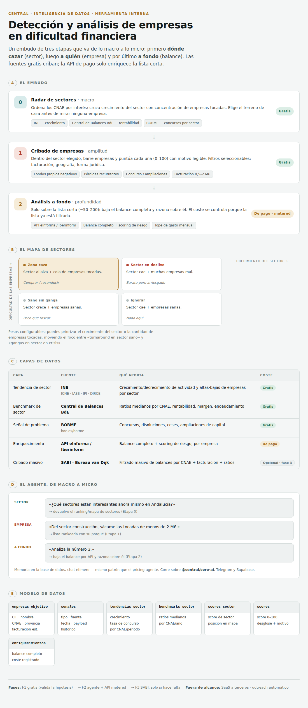

# Diseño — Detección y análisis de empresas en dificultad financiera

> **Estado:** borrador de diseño (brainstorming). Pendiente de revisión de Alberto antes de plan de implementación.
> **Fecha:** 2026-07-17
> **Rama:** `claude/empresas-problemas-financieros-h46hr6`

## 0. Esquema visual



## 1. Objetivo

Sistema **interno** que detecta y analiza **pymes pequeñas en dificultad financiera** (o que han "tocado
financiación") como oportunidades para **captar cliente** (asesoría/reestructuración/financiación) y, con un
flag, **comprar** (M&A oportunista). El uso a terceros (SaaS) queda **fuera de alcance de esta fase** por la
restricción contractual de redistribución de datos de las plataformas de pago.

La lógica diferencial es el **cruce sector↔empresa**: identificar sectores sanos/al alza donde una empresa
concreta va mal (mala gestión en buen mercado = reconducible/comprable), no solo "empresas que van mal".

## 2. Principio de arquitectura: embudo de tres etapas

El sistema es top-down: primero **dónde cazar** (sector), luego **a quién** (empresa), luego **a fondo**.

- **Etapa 0 — Radar de sectores (macro):** antes de mirar empresas, ordenar los sectores (CNAE) por interés
  según crecimiento y concentración de empresas en dificultad. Elige el terreno de caza. **Fuentes gratis.**
  Ver §4.
- **Etapa 1 — Cribado de empresas (amplitud):** dentro del/los sector(es) elegidos, barrer empresas para sacar
  candidatas. **Fuentes gratis** para no disparar el gasto.
- **Etapa 2 — Enriquecimiento/análisis (profundidad):** solo sobre la lista corta (~50–200), se bajan balances
  completos vía **API de pago metered**. El coste se controla porque la lista ya está filtrada.

**Regla:** nunca usar API de pago para barrer el mercado ni para el radar; solo para enriquecer supervivientes
del cribado gratis.

## 3. Fuentes de datos (en capas, de gratis a caro)

| Capa | Fuente | Qué aporta | Coste | Fase |
|---|---|---|---|---|
| Señal de problema | **BORME** (boe.es/borme) | Concursos de acreedores, disoluciones, ceses, nombramientos, ampliaciones de capital | 0€ | 1 |
| Tendencia de sector | **INE** (ICNE / IASS / IPI / demografía empresarial DIRCE) | Crecimiento/decrecimiento de actividad y altas-bajas de empresas por sector | 0€ | 0 |
| Benchmark de sector | **Central de Balances Banco de España** | Ratios medianos por sector (CNAE): rentabilidad, margen, endeudamiento. Sirve al radar (§4) y al cruce (§5) | 0€ | 0-1 |
| Enriquecimiento | **API eInforma / Iberinform** | Balance completo (patrimonio neto, EBITDA, fondo de maniobra, deuda), CNAE, facturación, administradores + scoring de riesgo, por empresa | €€ metered | 2 |
| Morosidad | **RAI (CCI)** + **ASNEF (Equifax)** o módulo de incidencias de eInforma/Iberinform | Impagos registrados por empresa (bloque A de §5) | €€ metered | 2 |
| Cribado masivo *(opcional)* | **SABI (Bureau van Dijk)** | Filtrado masivo de balances por CNAE+facturación+ratios | €€€€ | 3 (solo si el cribado gratis se queda corto) |

**Decisión:** arrancar con capas gratis (BORME + BdE) + eInforma metered. SABI solo si el cribado gratis
demuestra ser el cuello de botella. No redistribuir datos de fuentes de pago a terceros.

## 4. Radar de sectores (Etapa 0, macro)

Antes de mirar empresas, ordenar los CNAE por interés. No basta "sectores que crecen": para la tesis de
comprar/reconducir, el sector ideal combina **crecimiento** *y* **cola de empresas en dificultad**. Se pinta
como un mapa de dos ejes:

```
   Dificultad de las empresas (↑ = muchas tocadas)
   ▲
   │  🎯 ZONA CAZA          ⚠️ SECTOR EN DECLIVE
   │  crece + empresas mal     cae + empresas mal
   │  (comprar/reconducir)     (barato pero arriesgado)
   │
   │  😴 SANO SIN GANGA      🚫 IGNORAR
   │  crece + empresas sanas   cae + empresas sanas
   └──────────────────────────────────────►
        Crecimiento del sector (→ = crece)
```

**Métricas (todas gratis):**
- **Eje X — crecimiento:** INE (ICNE / IASS / IPI según sea servicios o industria) + variación de cifra de
  negocio en Central de Balances BdE.
- **Eje Y — dificultad:** **derivado del propio BORME** que ya ingerimos → por CNAE, tasa de
  concursos+disoluciones y tasa neta de creación (constituciones − bajas). **Coste extra 0€.**
- **Rentabilidad media del sector** (para confirmar que "va bien" de verdad): medianas de ROA/margen de BdE.

**Pesos configurables:** el usuario puede priorizar crecimiento del sector vs. cantidad de empresas tocadas
(mueve el foco entre la tesis "turnaround en sector sano" y "gangas en sector en crisis").

**Salida:** ranking/mapa de sectores con motivo legible ("Construcción residencial: actividad +8% interanual,
rentabilidad media sana, pero concursos +15% → zona caza"). Alimenta la selección de sector de la Etapa 1.

## 5. Variables / señales de EMPRESA (modelo de scoring)

Cada empresa recibe un **score compuesto (0–100)** con **motivo legible**. Cinco bloques.

**A. Problema financiero — umbrales concretos (Alberto, 17/07/2026)**

Ya implementados como bloque `SenalesFinancieras` en `lib/empresas-scoring.ts` (dormidos hasta que el
enriquecimiento rellene el dato; pesos = primera versión, tuneables):

| Señal | Umbral | Peso v1 | Fuente del dato |
|---|---|---|---|
| Patrimonio neto negativo | `< 0 €` o muy cercano a cero | 60 | Cuentas depositadas (balance) → eInforma |
| EBITDA negativo | negativo ≥ **2 ejercicios consecutivos** | 40 | Cuentas (P&L histórico) → eInforma |
| Fondo de maniobra negativo | `AC − PC < 0` de forma **sostenida** | 25 | Cuentas → eInforma |
| Depósito de cuentas con retraso | **> 12 meses** | 20 | Registro Mercantil / eInforma (fecha último depósito) — parte gratis (BORME publica depósitos) |
| Incidencias de pago | RAI / ASNEF / impagos registrados | 45 | **RAI** (CCI) + **ASNEF** (Equifax) o módulo *incidencias/morosidad* de eInforma/Iberinform |
| Deuda financiera | **Deuda/EBITDA > 6×** o refinanciaciones frecuentes | 35 / 20 | Cuentas (deuda + EBITDA) → eInforma; refis = BORME (novaciones/hipotecas) + histórico |
| Concurso de acreedores | evento | 70 | **BORME (gratis)** — ya ingerido |
| Disolución / extinción | evento | 45 | **BORME (gratis)** — ya ingerido |

**Nota de sourcing:** salvo concurso/disolución/ampliación (BORME, gratis, ya funcionando), **todo el bloque A
depende de las cuentas depositadas** → requiere eInforma. RAI/ASNEF pueden necesitar un **producto de morosidad
aparte** (Experian/Equifax) si el módulo de incidencias de eInforma no los cubre al detalle.

**B. "Tocó financiación"**
- Ampliaciones de capital recientes (BORME, gratis), entrada de socios, préstamos participativos, avales ICO, prendas/hipotecas.

**C. Contexto de sector (cruce estrella)**
- CNAE de la empresa vs. mediana del sector (Central de Balances BdE). Sector sano + empresa en cola = objetivo.

**D. Filtros de encaje (seleccionables por el usuario)**
- **Facturación:** rango configurable (defecto sugerido 0,5–2 M€). *(Requiere enriquecimiento: BORME no da cifra.)*
- **Geografía:** seleccionable — España entera o CCAA/provincia (p. ej. Andalucía/Sevilla).
- **Sector:** seleccionable — todos o uno/varios CNAE. *(CNAE por empresa requiere enriquecimiento.)*
- Antigüedad, nº empleados, forma jurídica (SL).

**E. Capa cualitativa MANUAL (no hay base de datos — investigación por objetivo)**

Señales de "porqué se vende" que ninguna API da; se rellenan a mano en la ficha de la candidata corta. Son
**oro** para priorizar (sucesión sin relevo, socio enfermo) pero no automatizables:
- **Edad del CEO / Consejo** (jubilación próxima). *Parcial:* administradores por eInforma/Registro dan a veces
  edad/fecha de nombramiento; la edad real no siempre es pública.
- **Salud** del/los administrador(es). Manual.
- **Descendencia / relevo generacional (Sí/No).** Manual.
- **Preconcurso** (comunicación art. 5 bis / plan de reestructuración). BORME/Registro — señal muy temprana.

El score y el motivo son lo que consume el agente. Los pesos de cada señal son configurables (fase de tuning);
los umbrales del bloque A están fijados en `lib/empresas-scoring.ts` (`RETRASO_CUENTAS_MESES`, `DEUDA_EBITDA_UMBRAL`, `PESO_FIN`).

## 6. Componentes

Encaja con la infra existente de `central` (`@central/core-ai`, cadena de fallback, Telegram, Supabase compartida).

1. **Ingesta (cron):** baja BORME diario + tendencias INE + benchmarks BdE → normaliza → Supabase. Llena la base
   **sin gasto**. Unidad aislada: entra "documento oficial", sale "señales estructuradas".
2. **Motor de radar de sectores:** agrega señales por CNAE → score de sector + posición en el mapa (§4). Puro
   y testeable en aislamiento.
3. **Motor de scoring de empresa:** aplica el modelo de la §5 sobre las señales almacenadas → score + motivo por
   empresa. Puro y testeable en aislamiento (entra empresa+señales+benchmarks, sale score+motivo).
4. **Enriquecimiento bajo demanda:** al marcar una candidata, tira de API eInforma → balance completo en BD.
   Metered, con tope de gasto. Aislado tras interfaz (poder cambiar de proveedor sin tocar el resto).
5. **Agente conversacional (macro→micro):** lenguaje natural que lleva de sector a empresa en la misma charla —
   "¿qué sectores interesan en Andalucía?" (radar) → "sácame las tocadas <2M de construcción" (cribado) →
   "analiza la nº3" (enriquecimiento + razonamiento sobre el balance). Memoria en BD, chat efímero (mismo
   patrón que pricing-agente / code-map).

### Encaje en el monorepo — decisión: módulo en `plataforma`, núcleo portable, promocionable a app

**Decisión (Alberto, 17/07/2026):** esto NO nace como vertical `apps/<app>` propia, sino como **módulo dentro
de `plataforma`** (el centro de mando interno). Razones: mismos usuarios (Alberto + 1), reaprovecha toda la
infra ya cableada (`@central/core-ai`, Telegram, Supabase, patrón de agente), y no añade proyecto Vercel /
`ignoreCommand` / rol de BD nuevos.

**Para no hipotecar la opción de app**, el núcleo se escribe como **paquete portable**
`@central/module-empresas` (`packages/module-empresas`, TS puro: ingesta, radar, scoring, agente — sin UI ni
deploy). `plataforma` solo lo **consume** y le pone pantalla. El día que interese convertirlo en producto para
terceros:

1. Se crea `apps/empresas` con su `vercel.json` + dominio + `ignoreCommand`.
2. Importa el **mismo** `@central/module-empresas` (cero reescritura de lógica).
3. La BD es la misma Supabase compartida → **los datos no se mueven**.

Es el patrón ya usado por `alquiler`/`transporte` (módulo puro + app fina). Módulo hoy (rápido, barato,
interno) sin cerrar la puerta a app mañana.

## 7. Modelo de datos (borrador Supabase)

- `empresas_objetivo` — identidad (CIF, nombre, CNAE, provincia, forma jurídica, facturación estimada).
- `senales` — evento/señal por empresa (tipo, fuente, fecha, payload); histórico.
- `benchmarks_sector` — ratios medianos por CNAE/año (Central de Balances).
- `tendencias_sector` — crecimiento y tasas de concurso/creación por CNAE/periodo (INE + BORME agregado); base del radar.
- `scores_sector` — score de sector + posición en el mapa, versionado por fecha de cálculo.
- `scores` — score compuesto de empresa + desglose + motivo legible, versionado por fecha de cálculo.
- `enriquecimientos` — balances completos bajados por API (con coste registrado para control de gasto). Campos
  del bloque A de §5: `patrimonio_neto`, `ebitda_n`, `ebitda_n1` (dos ejercicios), `fondo_maniobra`,
  `ultimo_deposito_cuentas` (fecha → retraso en meses), `incidencias_pago` (bool + detalle RAI/ASNEF),
  `deuda_financiera`, `deuda_ebitda` (ratio), `refinanciaciones` (count), `cnae`, `facturacion`, `n_empleados`.
- `ficha_cualitativa` — capa MANUAL del bloque E: `ceo_edad`, `consejo_edad_media`, `salud_nota`,
  `descendencia` (bool), `preconcurso` (bool/fecha), notas libres. La rellena el usuario, no una API.

Esquema/rol propio en la Supabase compartida (a confirmar nombre de rol, patrón de las demás verticales).
El motor de scoring (`lib/empresas-scoring.ts`) ya consume el bloque A vía `SenalesFinancieras` en cuanto estos
campos se pueblen; hoy están vacíos (dormidos) hasta contratar eInforma.

## 8. Fuera de alcance (esta fase)

- SaaS a terceros / redistribución de datos de pago.
- SABI (se pospone a fase 3 condicional).
- Automatizar el contacto/outreach a las empresas detectadas (primero detectar y analizar bien).
- Valoración/pricing de la operación de compra (posible fase posterior).

## 9. Riesgos / cuestiones abiertas

- **Cobertura del cribado gratis:** BORME da *eventos* (concurso, ampliaciones) bien, pero "fondos propios
  negativos en sector sano" sin evento puede requerir cuentas depositadas (de pago por empresa) o SABI. Validar
  en fase 1 cuántas candidatas salen solo con gratis antes de decidir SABI.
- **Calidad de la facturación estimada** en fuentes gratis (a menudo por tramos, no exacta).
- **Presupuesto eInforma:** definir tope mensual y coste por consulta antes de conectar la API.
- **Legalidad/uso:** datos de fuentes oficiales para uso interno; revisar términos de cada API antes de escalar.

## 10. Enfoque incremental sugerido

1. **F1 (gratis, valida la hipótesis):** ingesta BORME + tendencias INE + benchmarks BdE → **radar de sectores**
   + scoring de empresa + consulta básica. Sin gasto. Objetivo: ver si el embudo gratis genera sectores y
   candidatas útiles.
2. **F2 (agente + enriquecimiento):** agente conversacional macro→micro + API eInforma metered sobre lista corta.
3. **F3 (condicional):** SABI para cribado masivo solo si F1 se queda corto.
